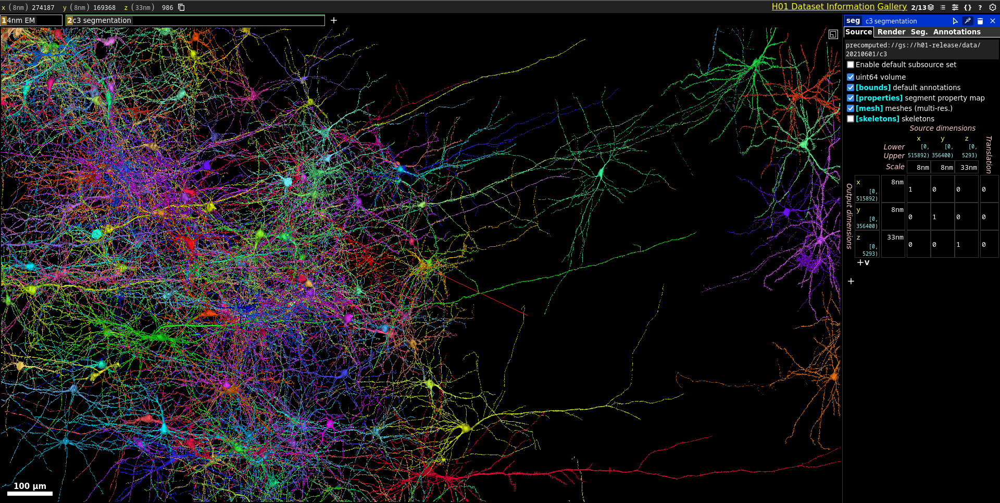
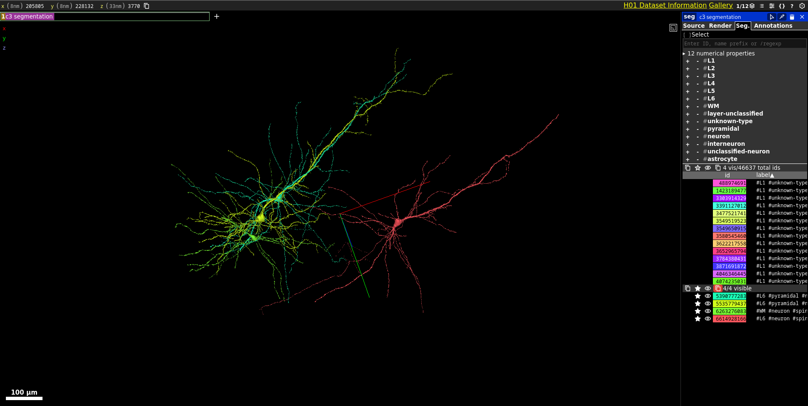

# Neuron2Obj

A tool for extracting neurons volumetric data from a Google Cloud Storage dataset as Wavefront (.obj) files.

---

# USAGE

## 1. First, launch <a href="neuroglancer-demo.appspot.com/">Neuroglancer</a> and render a precomputed dataset.

Example:

<a href="http://h01-dot-neuroglancer-demo.appspot.com/#!gs://h01-release/assets/neuroglancer_states/20210729/library_state.json">precomputed://gs://h01-release/data/20210601/c3</a>



## 2. Select your desired neuron(s).

Example: 

`5390777283,5535779437,6263276083,6614928166`



## 3. Download'em!

Example:

```shell
 python3 neuron2obj.py precomputed://gs://h01-release/data/20210601/c3 5390777283,5535779437,6263276083,6614928166 --lod=1
```

---

**NOTE:** Aditional info can be obtained by running:

```shell
python3 neuron2obj.py --help
```
